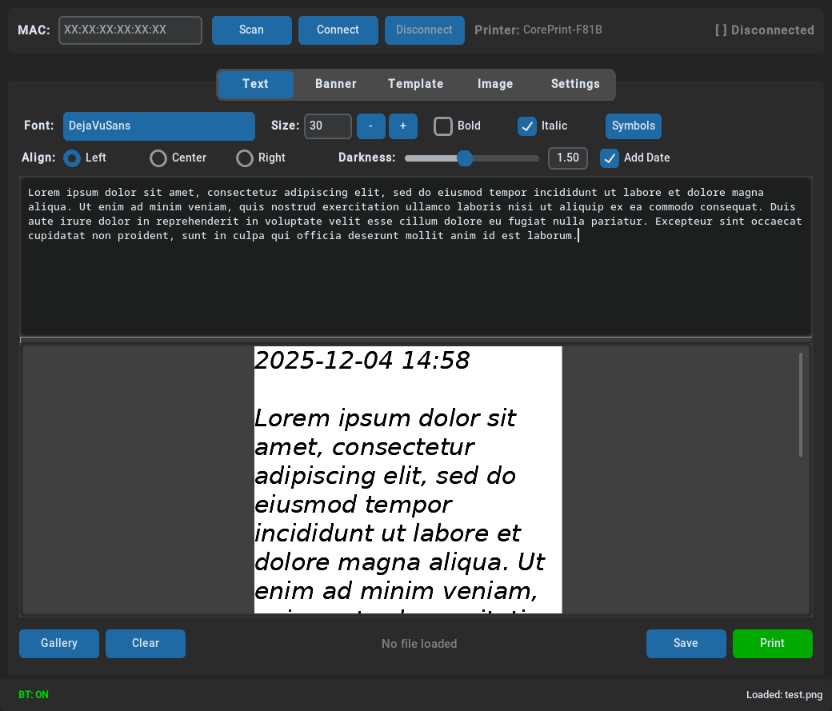
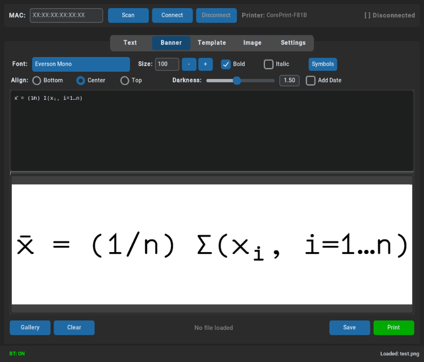
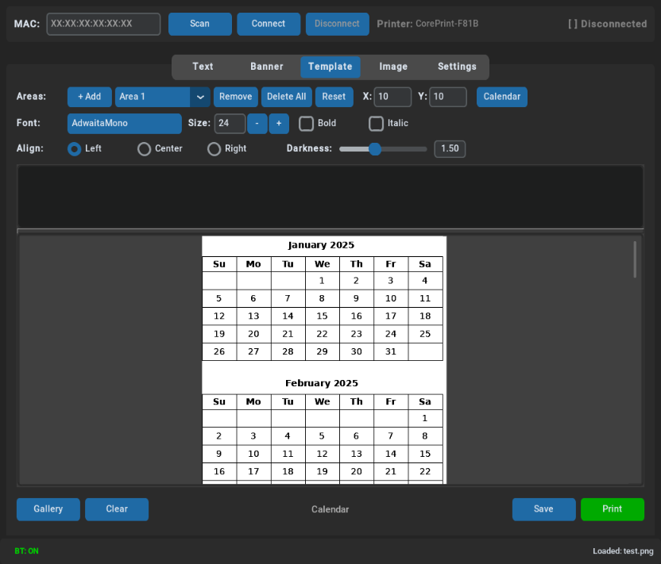
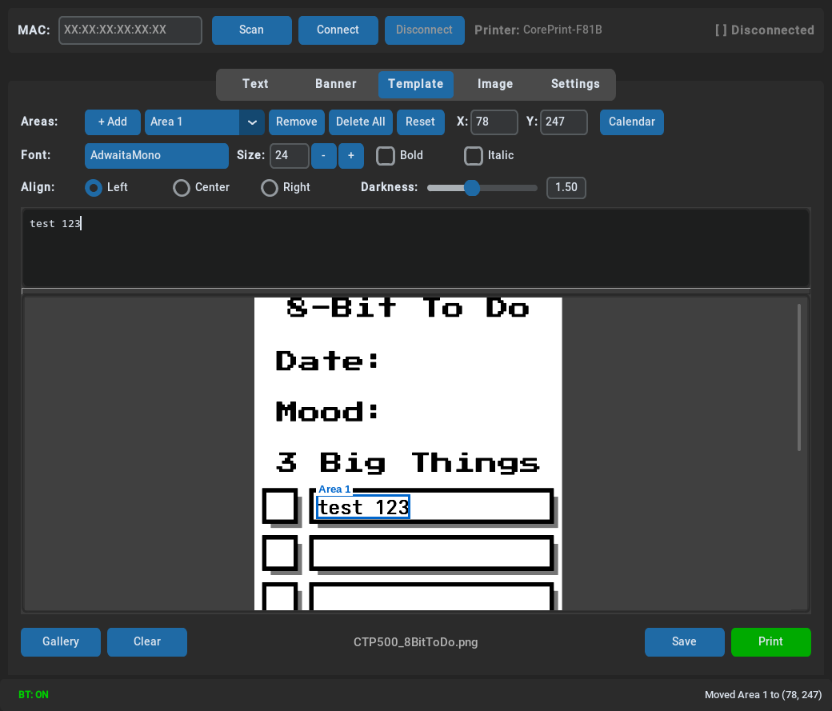
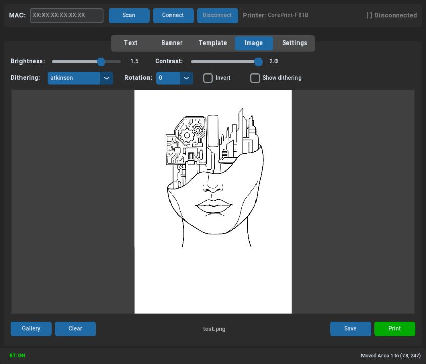
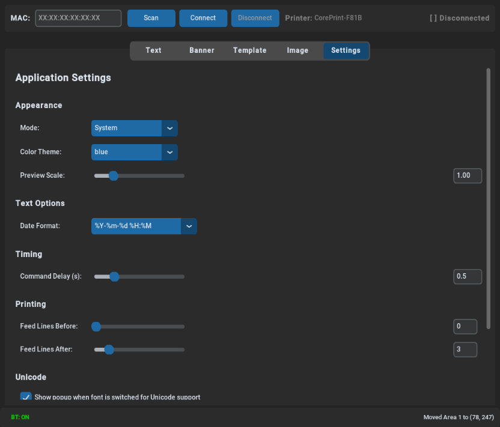

# Thermal Printer

A modern GUI application for controlling Bluetooth thermal printers on Linux. Currently supports the Core Innovation CTP-500, with more printers planned.


## Table of Contents

- [Features](#features)
- [Screenshots](#screenshots)
- [Quick Start](#quick-start)
- [Requirements](#requirements)
- [Installation](#installation)
- [Usage](#usage)
- [Templates](#templates)
- [Configuration](#configuration)
- [Troubleshooting](#troubleshooting)
- [Unicode Font Support](#unicode-font-support)
- [Credits and Acknowledgments](#credits-and-acknowledgments)
- [License](#license)
- [Contributing](#contributing)
- [Related Projects](#related-projects)

## Features

### Printing Modes

- **Text Printing** - Type or load text files with customizable fonts, sizes, alignment, and darkness control
- **Banner Printing** - Create vertical banners with 90-degree rotated text for receipt paper
- **Template Printing** - Design labels with multiple drag-and-drop text areas, each with independent formatting
- **Image Printing** - Print images with brightness/contrast controls and 7 dithering algorithms (Floyd-Steinberg, Ordered, Atkinson, Burkes, Sierra, Stucki, None)
- **Calendar Printing** - Generate printable weekly, monthly, or yearly calendars

### Connection and Hardware

- **Bluetooth Scanner** - Scan and connect to nearby thermal printers with auto-detection
- **Auto-Reconnect** - Automatic reconnection with exponential backoff on connection loss
- **Print Job Management** - Progress tracking with cancellation support

### User Interface

- **Dark/Light Mode** - Follows system theme or manual selection
- **Print Preview** - Real-time preview with adjustable scaling (0.5x - 3x zoom)
- **Font Selection** - Choose from any font installed on your system
- **Symbol Picker** - Insert from 860+ Unicode symbols across 63 categories (math, Greek, arrows, shapes, and more)
- **Template Gallery** - Browse saved templates with thumbnail previews in 4 adjustable sizes
- **Wayland Compatible** - Full support for Wayland compositors including COSMIC, GNOME, KDE, Sway, and wlroots-based

### Text and Unicode

- **Unicode Support** - Automatic font fallback for special characters (math and logic symbols, Greek letters, etc...)
- **Date Insertion** - Optionally add formatted timestamps to prints
- **Feed Line Control** - Configurable blank lines before and after prints

## Screenshots



<details>
<summary>More screenshots</summary>







</details>

## Quick Start

```bash
# Clone and enter directory
git clone https://github.com/n3m0-22/thermal-printer.git
cd thermal-printer

# Create virtual environment and install dependencies
python3 -m venv .venv_print
source .venv_print/bin/activate
pip install -r requirements.txt

# Run the application
./run.sh
```

## Requirements

- Linux (or Windows with WSL2)
- Python 3.10 or higher
- Bluetooth adapter
- BlueZ (Linux Bluetooth stack)

## Installation

### 1. Clone the Repository

```bash
git clone https://github.com/n3m0-22/thermal-printer.git
cd thermal-printer
```

### 2. Install System Dependencies

**Fedora/RHEL:**

```bash
sudo dnf install python3 python3-pip python3-tkinter bluez
```

**Ubuntu/Debian:**

```bash
sudo apt install python3 python3-pip python3-tk bluez
```

**Arch Linux:**

```bash
sudo pacman -S python python-pip tk bluez
```

**Wayland Systems (GNOME, KDE Plasma, Sway, Hyprland, etc.):**

If you are running a Wayland desktop environment, you also need `wl-clipboard` for clipboard operations to work correctly:

```bash
# Fedora/RHEL
sudo dnf install wl-clipboard

# Ubuntu/Debian
sudo apt install wl-clipboard

# Arch Linux
sudo pacman -S wl-clipboard
```

This is required because tkinter runs under XWayland, and the native X11 clipboard does not reliably communicate with Wayland applications. The app automatically detects Wayland and uses `wl-copy`/`wl-paste` for clipboard operations.

**X11 Systems (X.org, i3, XFCE, etc.):**

For X11 clipboard operations, you need either `xclip` (preferred) or `xsel`:

```bash
# Fedora/RHEL
sudo dnf install xclip

# Ubuntu/Debian
sudo apt install xclip

# Arch Linux
sudo pacman -S xclip
```

The app tries xclip first and falls back to xsel if not available. If neither is installed, clipboard operations will use tkinter's built-in clipboard which may have limited functionality.

### 3. Create Virtual Environment and Install Python Dependencies

```bash
python3 -m venv .venv_print
source .venv_print/bin/activate
pip install -r requirements.txt
```

### 4. Run the Application

```bash
./run.sh
```

### 5. (Optional) Install Desktop Entry

To add the app to your application launcher:

```bash
./install-desktop.sh
```

The app will appear in your applications menu. You may need to log out and back in for it to show up.

## Windows (WSL2)

This application can run on Windows using WSL2 with a Linux GUI environment:

1. Install WSL2 with a Linux distribution (Ubuntu recommended)
2. Install an X server like [VcXsrv](https://sourceforge.net/projects/vcxsrv/) or use WSLg (Windows 11)
3. Follow the Linux installation steps above
4. For Bluetooth, you may need to use USB/IP to pass through your Bluetooth adapter to WSL

## Usage

### Connecting to Your Printer

1. Launch the application
2. Click "Scan" to find nearby printers
3. Select your printer from the list (CTP printers are highlighted in green)
4. Click "Connect"

> **Note:** After connecting once, the app remembers your printer. On future launches, simply click "Print" and it will auto-connect to your last used printer.

### Text Mode

1. Go to the "Text" tab
2. Type your text or click "Load" to open a text file
3. Adjust font, size, alignment, and darkness as needed
4. Use the symbol picker to insert special characters
5. Click "Preview" to see the output
6. Click "Print" to send to printer

### Banner Mode

1. Go to the "Banner" tab
2. Enter text for vertical printing (rotated 90 degrees)
3. Choose vertical alignment (Top, Center, Bottom)
4. Adjust font and size for banner display
5. Preview and print

### Template Mode

1. Go to the "Template" tab
2. Click "Gallery" to browse saved templates, or load a custom image
3. Click "+ Add" to create text areas on the template
4. Drag text areas to position them on the template
5. Select each area to edit its text, font, size, and alignment
6. Use Ctrl+C/Ctrl+V to copy/paste text areas
7. Save your template for future use (.pcfg format)
8. Preview and print

### Image Mode

1. Go to the "Image" tab
2. Click "Load Image" to select an image file
3. Adjust brightness, contrast, rotation, and dithering algorithm
4. Available dithering modes: None, Floyd-Steinberg, Ordered, Atkinson, Burkes, Sierra, Stucki
5. Click "Preview" to see how it will print
6. Click "Print" to send to printer

### Calendar Printing

1. From the Text or Template tab, click the calendar button
2. Choose calendar type:
   - **Current Week** - Weekly planner with note areas
   - **Individual Months** - Select specific months to print
   - **Full Year** - All 12 months
3. Click "Generate" to create calendar images
4. Preview and print

### Symbol Picker

1. From any text input, click the symbol button
2. Browse 63 categories including:
   - Basic arithmetic and calculus
   - Greek letters (uppercase and lowercase)
   - Logic and set theory
   - Arrows and geometry
   - Statistics and probability notation
3. Click a symbol to insert it, or use the search bar
4. Symbols are rendered with automatic font fallback

## Templates

The `gallery/templates/` directory contains sample print templates from [ThirtyThreeDown's CTP500PrinterApp](https://github.com/thirtythreedown/CTP500PrinterApp) that you can use or modify.

### Template Format

Templates are saved as `.pcfg` (Print Configuration) files containing:

- Template background image path
- Text area positions and dimensions
- Font settings per text area
- Alignment and formatting options

Thumbnails are automatically generated and stored in the `thumbs/` subdirectory.

## Configuration

Settings are automatically saved to `config.yaml` and include:

### Printer Settings

- Last connected printer (MAC address and name)
- RFCOMM channel

### Text and Banner Settings

- Font family, size, bold, italic
- Text alignment and darkness
- Date format and auto-insertion

### Image Settings

- Brightness and contrast (0.0 - 2.0)
- Dithering algorithm
- Rotation and invert options

### GUI Settings

- Window size and position
- Appearance mode (System/Light/Dark)
- Color theme
- Preview scale (0.5x - 3.0x)
- Gallery thumbnail size

### Timing Settings

- Command delay between printer operations
- Bluetooth scan timeout

### Printing Settings

- Feed lines before print (0-20)
- Feed lines after print (0-20)

## Troubleshooting

### "Connection refused" or "No route to host"

- Make sure the printer is turned on and paired
- Check that Bluetooth is enabled: `bluetoothctl power on`
- Try re-pairing the printer

### "Permission denied" on Bluetooth

Add your user to the `bluetooth` group:

```bash
sudo usermod -aG bluetooth $USER
```

Then log out and back in.

### Printer not found during scan

- Ensure the printer is in pairing mode (turned on, not connected to another device)
- Check Bluetooth is working: `bluetoothctl scan on`
- Increase scan timeout in Settings tab

### Fonts not showing up

Install additional fonts:

```bash
# Fedora
sudo dnf install dejavu-sans-mono-fonts google-noto-sans-mono-fonts

# Ubuntu/Debian
sudo apt install fonts-dejavu fonts-noto-mono
```

### Unicode symbols showing as boxes

- Install the bundled Catrinity font from the `fonts/` directory
- Or select a Unicode-capable font in Settings (DejaVu Sans, Noto Sans)

### Clipboard not working on Wayland

Install wl-clipboard:

```bash
# Fedora
sudo dnf install wl-clipboard

# Ubuntu/Debian
sudo apt install wl-clipboard
```

### Preview works but print fails

- Check Bluetooth connection status in the Connection tab
- Verify printer has paper and is powered on
- Try increasing command delay in Settings

## Unicode Font Support

For best Unicode symbol support (math operators, arrows, Greek letters, etc.), the application includes **Catrinity** font in the `fonts/` directory, licensed under the [SIL Open Font License](http://scripts.sil.org/OFL).

### Bundled Font

| Font | License | Notes |
|------|---------|-------|
| **Catrinity** | SIL OFL (Free) | Bundled with app, 80,000+ characters ([catrinity-font.de](https://catrinity-font.de/)) |

### Recommended System Fonts (Not Bundled)

These fonts provide excellent Unicode coverage and are recommended for installation on your system:

| Font | License | Notes |
|------|---------|-------|
| DejaVu Sans | Free | Usually pre-installed on Linux |
| Noto Sans | SIL OFL (Free) | Google's comprehensive Unicode font |
| STIX Two | SIL OFL (Free) | Excellent math symbol support |

Install these fonts using your package manager:

```bash
# Fedora/RHEL
sudo dnf install dejavu-sans-fonts google-noto-sans-fonts stix-fonts

# Ubuntu/Debian
sudo apt install fonts-dejavu fonts-noto ttf-stix

# Arch Linux
sudo pacman -S ttf-dejavu noto-fonts otf-stix
```

### Additional Fonts (Optional)

These fonts have excellent Unicode coverage but require manual download:

| Font | License | Link |
|------|---------|------|
| Quivira | Freeware | [quivira-font.com](http://www.quivira-font.com/) |
| Everson Mono | Shareware | [evertype.com/emono](https://www.evertype.com/emono/) |
| Code2000 | Shareware | [code2001.com](https://www.code2001.com/code2000_page.htm) |

To use these fonts, download and install them to your system fonts directory or place them in the project's `fonts/` folder.

### Automatic Font Fallback

When you type special characters, the app automatically:

1. Detects Unicode characters that your selected font cannot render
2. Searches fallback fonts (Catrinity, Noto Sans Math, STIX Two, etc.)
3. Renders each character with the best available font
4. Optionally shows a notification (can be disabled in Settings)

## Credits and Acknowledgments

This project builds upon the incredible reverse engineering work of the maker and hacker community who cracked the Core Innovation CTP-500 Bluetooth thermal printer protocol.

### Original Research and Development

**Mel (ThirtyThreeDown Studio)** - Primary developer of the original CTP500PrinterApp, Bluetooth protocol analysis and GUI implementation.

- [thirtythreedown.com](https://thirtythreedown.com)
- [CTP500PrinterApp on GitHub](https://github.com/thirtythreedown/CTP500PrinterApp)

**voidsshadows** - Creator of CorePrint print server, stripped-down Python implementation that formed the foundation.

- [CorePrint on GitHub](https://github.com/voidsshadows/CorePrint-print-server)

### SECKC Contributors

Kansas City's Hacker Hive - [seckc.org](https://seckc.org)

- **bitflip** - Shared critical code resources and collaboration
- **Tsathoggualware** - Research and development support
- **Reid** - Research and development support

### Community Contributors

- **onezeronull, MaikelChan, rbaron, WerWolv** - Prior thermal printer research and documentation
- **Nathaniel (Doodad/Dither Me This)** - Dithering algorithm inspiration
- **Hacking Modern Life (YouTube)** - Bluetooth reverse engineering tutorials

### Special Thanks

> *"To all the mad lasses and lads in the maker community whose thermal
> printer research since 2014 made this possible."*
>
> -- Mel, ThirtyThreeDown Studio

## License

This project is licensed under the **GNU Affero General Public License v3.0** (AGPL-3.0).

Based on work from:

- [CTP500PrinterApp](https://github.com/thirtythreedown/CTP500PrinterApp) by ThirtyThreeDown Studio
- [CorePrint](https://github.com/voidsshadows/CorePrint-print-server) by voidsshadows (AGPL-3.0)

## Contributing

Contributions are welcome! Please feel free to submit issues or pull requests.

## Related Projects

- [CTP500PrinterApp](https://github.com/thirtythreedown/CTP500PrinterApp) - Original project by ThirtyThreeDown
- [CorePrint-print-server](https://github.com/voidsshadows/CorePrint-print-server) - Minimal Python implementation

## TODO

- [ ] Create executable binary
- [ ] Various bug fixes
- [ ] Refactor out duplicate code
- [ ] Markdown support
- [ ] Add LaTeX or MathML support
